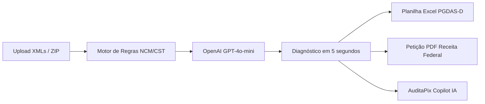

# 💰 AuditaPix & NotaCerta — Estudo de Impacto, Modelo Econômico e Potencial de Recuperação Retroativa

> **Documento Estratégico & Justificativa de Negócio**  
> **Trilha:** Pequenos Negócios | **OpenAI Hackathon 2026**

---

## 🎯 1. Sumário Executivo

O **AuditaPix & NotaCerta** é uma plataforma de inteligência fiscal autônoma movida por IA (OpenAI GPT-4o-mini + Motor de Regras Tributárias SPED) que identifica e recupera pagamentos indevidos de tributos federais (**PIS e COFINS**) em empresas brasileiras optantes pelo **Simples Nacional**.

A ferramenta atua sobre o **Regime Tributário Monofásico**, onde a cobrança dos tributos já foi concentrada e quitada pelos fabricantes e importadores. Ao auditar centenas de notas fiscais eletrônicas (XMLs de NF-e) em segundos, a plataforma identifica as glosas e bitributações, calcula os valores a restituir e entrega a planilha de retificação do PGDAS-D e a petição administrativa formal para restituição via **Pix / Conta Bancária**.

---

## 🛑 2. O Problema Real: O "Imposto Fantasma" no Simples Nacional

### Como funciona a armadilha tributária?
No Brasil, setores inteiros do comércio varejista e de serviços estão enquadrados no **Regime Monofásico de PIS/COFINS**:
- 🚗 **Autopeças e Pneus** (Lei nº 10.485/2002)
- 🍺 **Bebidas Frias:** Cervejas, refrigerantes, energéticos e águas (Lei nº 13.097/2015)
- 💊 **Farmácias, Cosméticos e Higiene Pessoal** (Lei nº 10.147/2000)

Nesse regime, a **indústria ou importador recolhe todo o imposto da cadeia produtiva** com alíquotas majoradas. As etapas seguintes (distribuidores, oficinas mecânicas, bares, mercados, drogarias e autopeças) têm **ALÍQUOTA ZERO (CST 04)** na revenda desses produtos.

### Por que 80%+ das pequenas empresas pagam imposto em dobro?
1. **XMLs Emitidos Incorretamente por Fornecedores:** Grandes distribuidoras emitem notas fiscais com CSTs tributáveis ordinários (CST 01, 49, 99 ou CSOSN genérico) por falhas em seus ERPs.
2. **Falta de Segregação no PGDAS-D:** A maioria dos escritórios de contabilidade e softwares emissores das pequenas empresas lança o faturamento total sob a regra padrão do Simples Nacional (Anexo I ou Anexo III), sem segregar os produtos monofásicos.
3. **Complexidade e Custo de Auditoria Tradicional:** Consultorias tributárias cobram de R$ 5.000 a R$ 20.000 de entrada e levam semanas analisando arquivos no Excel, tornando a recuperação inviável para oficinas mecânicas, bares e pequenos comércios.

**O Resultado:** O pequeno empresário paga de **3.0% a 4.5% a mais de imposto** sobre tudo o que vende nessas categorias, drenando o capital de giro do negócio.

---

## 💡 3. A Solução AuditaPix & NotaCerta



1. **Velocidade Extrema (5 Segundos):** Parser resiliente em Python processa centenas de XMLs simultâneos ou arquivos comprimidos `.zip`.
2. **Diagnóstico Preciso de NCMs:** Cruzamento exato contra a Tabela SPED 4.3.10/4.3.11 e legislação vigente.
3. **Inteligência Artificial Explicativa:** Gera parecer pericial com linguagem direta para o empresário e fundamentação jurídica formal (artigos de lei) para a Receita Federal.
4. **Pronto para Restituição:** Gera a planilha de recálculo do PGDAS-D e o Requerimento Administrativo oficial em PDF.
5. **AuditaPix Copilot:** Assistente interativo em linguagem natural para responder dúvidas tributárias e orientar a contabilidade.

---

## 📈 4. Estimativa de Economia e Recuperação Retroativa (Últimos 5 Anos)

De acordo com o **Artigo 168, Inciso I do Código Tributário Nacional (Lei nº 5.172/1966)**, todo contribuinte tem o direito inalienável de solicitar a restituição dos tributos pagos indevidamente nos últimos **5 anos (60 meses)**.

### 📊 Simulações de Recuperação Financeira por Segmento e Porte:

| Segmento / Tipo de Negócio | Faturamento Médio Mensal | % Mix de Produtos Monofásicos | Faturamento Monofásico Mensal | Glosa Média PIS/COFINS (3.65%) | **Economia Mensal Futura** | **RECUPERAÇÃO RETROATIVA (60 MESES)** |
| :--- | :---: | :---: | :---: | :---: | :---: | :---: |
| 🔧 **Pequena Oficina Mecânica / Auto Center** | R$ 50.000,00 | 70% (Peças) | R$ 35.000,00 | R$ 1.277,50 / mês | **R$ 1.277,50** | **R$ 76.650,00** |
| 🚗 **Auto Center Médio / Centro Automotivo** | R$ 150.000,00 | 75% (Peças/Pneus) | R$ 112.500,00 | R$ 4.106,25 / mês | **R$ 4.106,25** | **R$ 246.375,00** |
| 🍻 **Bar / Choperia / Restaurante** | R$ 80.000,00 | 45% (Bebidas Frias) | R$ 36.000,00 | R$ 1.314,00 / mês | **R$ 1.314,00** | **R$ 78.840,00** |
| 🛒 **Distribuidora de Bebidas / Conveniência** | R$ 200.000,00 | 85% (Cervejas/Refris) | R$ 170.000,00 | R$ 6.205,00 / mês | **R$ 6.205,00** | **R$ 372.300,00** |
| 💊 **Drogaria / Perfumaria de Bairro** | R$ 120.000,00 | 60% (Medicamentos/Shampoos) | R$ 72.000,00 | R$ 2.628,00 / mês | **R$ 2.628,00** | **R$ 157.680,00** |
| 🐶 **Pet Shop com Clínica Veterinária** | R$ 60.000,00 | 40% (Medicamentos/Higiene) | R$ 24.000,00 | R$ 876,00 / mês | **R$ 876,00** | **R$ 52.560,00** |

> 💡 **Exemplo Real do Pitch:**  
> Uma oficina mecânica de bairro que fatura R$ 60.000/mês recupera em média **R$ 1.840,00 a cada lote de notas de autopeças** auditado. No acumulado dos últimos 5 anos, isso representa mais de **R$ 110.000,00 em dinheiro vivo** depositado na conta da empresa!

---

## ⚡ 5. Como Funciona o Recebimento (Processo 100% Administrativo)

Ao contrário de teses jurídicas complexas que demoram anos na justiça, a restituição de PIS/COFINS monofásico do Simples Nacional é **100% eletrônica e administrativa**:

```
[1] Upload dos XMLs no AuditaPix
       ⬇️ (5 segundos)
[2] Geração da Memória PGDAS-D e Petição PDF
       ⬇️
[3] Contador retifica os meses no Portal do Simples Nacional
       ⬇️
[4] Solicitação no módulo "Restituição Eletrônica" (e-CAC / Simples)
       ⬇️ (15 a 60 dias úteis)
[5] Depósito do Dinheiro via Pix ou Conta Corrente da Empresa
```

- **Sem Risco de Multa:** A retificação é um direito formal expressamente previsto no **art. 18, § 4º-A, inciso I da Lei Complementar 123/2006** e referendado por diversas **Soluções de Consulta Cosit da Receita Federal (ex: Cosit nº 225/2014 e Cosit nº 394/2017)**.
- **Correção pela Taxa SELIC:** O valor a ser restituído é corrigido monetariamente pela taxa SELIC acumulada do período.

---

## 🌍 6. Impacto Social e Econômico

1. **Democratização da Inteligência Tributária:** Transforma uma perícia tributária que custava R$ 15.000 em uma análise instantânea e acessível para qualquer microempresário.
2. **Injeção de Liquidez no Pequeno Negócio:** Transforma notas fiscais paradas em capital de giro imediato para reinvestir em maquinário, reformas, quitação de dívidas ou contratação de funcionários.
3. **Prevenção Contínua:** Além de recuperar o passado (60 meses), o sistema ensina o empresário e seu contador a parametrizar o sistema com **CST 04**, blindando a empresa de perder dinheiro no futuro.

---

## 🏆 7. Por Que Esse Projeto Ganha o Hackathon?

- **ROI Imediato e Mensurável:** Não é apenas um "assistente de texto" — é uma ferramenta de **geração direta de caixa**. O usuário faz o upload e vê o dinheiro real voltar para a sua conta.
- **Solução de Dor Real:** Resolve um problema que atinge mais de **4 milhões de pequenas empresas** no Brasil.
- **Execução Técnica Impecável:**
  - Stack moderna: FastAPI + OpenAI GPT-4o-mini + LXML + OpenPyXL + ReportLab.
  - UI/UX de alto padrão: Dark Glassmorphism, Chart.js, animações e feedback instantâneo.
  - Fallback autônomo e modo offline resiliente para apresentações de pitch sem riscos.
