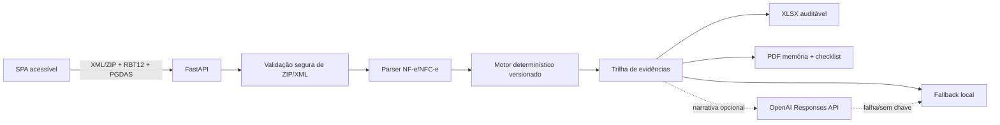

# Audita

Audita é uma plataforma local-first de apoio à revisão de receitas monofásicas de PIS/Cofins para empresas do Simples Nacional. Ela combina XMLs de **venda**, contexto do PGDAS-D, regras versionadas e explicações rastreáveis para encontrar indícios de pagamento indevido ou a maior.

> O resultado é uma estimativa técnica. Não é crédito garantido, parecer jurídico, petição ou transmissão à Receita. Valide documentos, enquadramento e estratégia com o contador; manifestações jurídicas devem ser revistas por advogado.

## Rodar em um comando

Requisitos: macOS/Linux, Python 3.12 e internet apenas na primeira instalação das dependências.

```bash
cd software
./run.sh
```

Acesse [http://localhost:8000](http://localhost:8000). Para validar o ambiente sem manter servidor aberto:

```bash
./run.sh --check
```

O script cria `.venv` se necessário. A aplicação funciona sem chave OpenAI; o parecer e o Copilot usam fallback local. Para desenvolvimento:

```bash
cp .env.example .env
# substitua o placeholder somente no arquivo local, que é ignorado pelo Git
./run.sh
```

## Demo de três minutos

1. Pressione **Demo 3 min — Oficina**.
2. O backend lê cinco XMLs sintéticos, explicitamente sem valor fiscal.
3. O cenário mostra **R$ 1.840,00 de potencial estimado**, não “valor a receber”.
4. Abra as fontes por item, filtre a tabela e use o Copilot.
5. Baixe o Excel e a memória/checklist em PDF.

Também é possível enviar `sample_invoices/lote_oficina_mecanica_5_notas.zip` pela dropzone.

## Arquitetura



O motor de regras decide classificação e valores. A IA recebe somente números já calculados e produz narrativa; ela não altera NCM, status ou potencial.

## Modelo de cálculo

O MVP suporta as faixas 1 a 5 do Anexo I (RBT12 até R$ 3,6 milhões):

```text
alíquota efetiva DAS = (RBT12 × alíquota nominal − parcela a deduzir) ÷ RBT12
alíquota efetiva PIS/Cofins = alíquota efetiva DAS × 15,5%
potencial estimado = receita de venda confirmada e não segregada × alíquota efetiva PIS/Cofins
```

Se a receita já foi segregada no PGDAS-D, o potencial é zero. O sistema calcula por item com `Decimal` e arredondamento monetário.

No cenário sintético:

| Premissa | Valor |
|---|---:|
| RBT12 | R$ 1.800.000,00 |
| Alíquota nominal / parcela a deduzir | 10,7% / R$ 22.500,00 |
| Alíquota efetiva DAS | 9,45% |
| Fração PIS/Cofins do DAS | 15,5% |
| Alíquota efetiva PIS/Cofins | 1,46475% |
| Receita monofásica sintética | R$ 125.618,71 |
| Potencial estimado | R$ 1.840,00 |

## Regra de enquadramento

NCM não é uma simples lista de oito dígitos. Uma regra pode usar posição/subposição, exceção `Ex`, descrição, destinação, papel do vendedor e vigência. O Audita retorna:

- `CONFIRMADO`: catálogo versionado e evidências do XML são compatíveis;
- `REVISAR`: há correspondência, mas falta comprovar condição legal;
- `NAO_ENQUADRADO`: nenhuma regra do catálogo MVP ou exclusão expressa.

O catálogo é propositalmente apresentado como subconjunto operacional, nunca como lista legal universal. CST de PIS/Cofins é um sinal; CSOSN pertence ao ICMS e fica em campo separado. XML de compra isolado não prova receita nem pagamento a maior.

## Endpoints

| Método | Rota | Uso |
|---|---|---|
| `GET` | `/api/health` | saúde e modo de IA, sem revelar chave |
| `POST` | `/api/config/set-key` | chave efêmera somente em memória |
| `POST` | `/api/audit/upload` | lote XML/ZIP + RBT12/PGDAS/período |
| `POST` | `/api/audit/demo-oficina` | cenário sintético calibrado |
| `POST` | `/api/audit/copilot` | dúvida fiscal com fontes e limites |
| `POST` | `/api/export/excel` | workbook com memória e fórmulas |
| `POST` | `/api/export/pdf` | memória de cálculo/checklist |

Limites do upload: 30 XMLs, 25 MB por lote, 10 MB por XML e proteção contra path traversal/ZIP bomb.

## Privacidade e segurança

- não há banco de dados nem retenção de XMLs;
- a chave OpenAI nunca é devolvida, persistida ou registrada;
- DTD/entidades externas são rejeitadas;
- conteúdo da tabela e do Copilot é inserido com APIs seguras do DOM, sem `innerHTML`;
- o fallback local mantém demo e análise disponíveis sem rede;
- as fixtures têm CNPJs fictícios e marcador `SEM VALOR FISCAL`.

## OpenAI opcional

Com chave válida, `gpt-4o-mini` é chamado pela Responses API com saída estruturada para `resumo`, `fundamentacao`, `plano_acao` e `alertas`. Timeout, erro de credencial ou rede acionam o fallback sem quebrar o fluxo.

## Testes

```bash
.venv/bin/pytest -q
```

A suíte cobre cálculo, regras, namespaces XML, segurança ZIP, fallback, planilha, PDF, API, acessibilidade estática e calibração da demo.

## Fontes normativas primárias

- [Lei Complementar 123/2006, art. 18](https://www.planalto.gov.br/ccivil_03/leis/lcp/lcp123.htm)
- [CTN, arts. 165 e 168](https://www.planalto.gov.br/ccivil_03/leis/l5172compilado.htm)
- [Resolução CGSN 140/2018](https://normas.receita.fazenda.gov.br/sijut2consulta/link.action?idAto=92278)
- [IN RFB 2.055/2021](https://normas.receita.fazenda.gov.br/sijut2consulta/link.action?idAto=121747)
- [Lei 10.147/2000 — farmacêuticos e perfumaria](https://www.planalto.gov.br/ccivil_03/leis/l10147.htm)
- [Lei 10.485/2002 — veículos, autopeças e pneus](https://www.planalto.gov.br/ccivil_03/leis/2002/l10485compilado.htm)
- [Lei 13.097/2015 — bebidas frias](https://www.planalto.gov.br/ccivil_03/_ato2015-2018/2015/lei/l13097.htm)
- [Tabela SPED 4.3.10](https://www.gov.br/sped/pt-br/assuntos/escrituracoes-digitais/efd-contribuicoes/tabelas-de-codigos/tabelas-utilizadas-na-apuracao-das-contribuicoes-para-o-pis-pasep-e-da-cofins/tabela-4-3-10)
- [Tabela SPED 4.3.11](https://www.gov.br/sped/pt-br/assuntos/escrituracoes-digitais/efd-contribuicoes/tabelas-de-codigos/tabelas-utilizadas-na-apuracao-das-contribuicoes-para-o-pis-pasep-e-da-cofins/tabela-4-3-11)

Veja também os documentos na raiz do repositório, em especial `NCM_MONOFASICO_REGRAS_E_FONTES.md`, `BASE_LEGAL_E_FONTES.md`, `ESTATISTICAS_E_DADOS_REAIS.md` e `CONCORRENTES_E_INOVACAO.md`.

## Limites do MVP

- não transmite PGDAS-D, PER/DCOMP ou pedido de restituição;
- não substitui classificação fiscal profissional;
- não cobre todos os setores ou regras históricas das tabelas SPED;
- não garante deferimento, prazo ou pagamento;
- requer novo catálogo para fatos geradores sob a CBS na transição iniciada em 2027.
